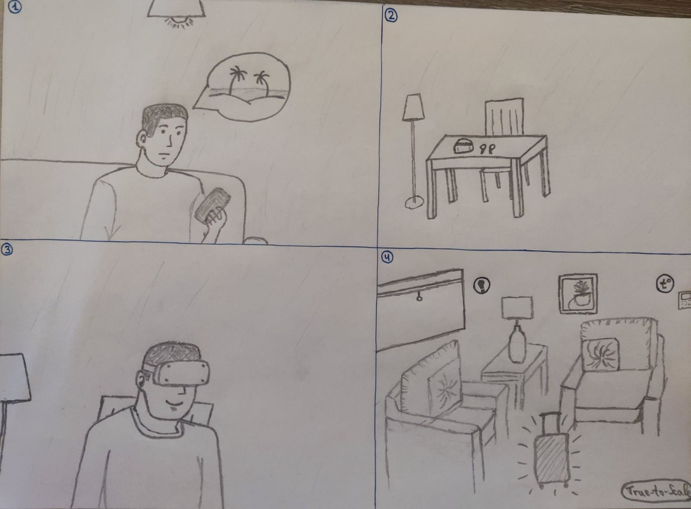

# ARBNB
* You are a vivid person who loves traveling. You do your own research very carefully. You use a mobile app to view stats and data about each commodity for AirBnB or Booking. Moreover, you use MR Headset to explore the premises remotely and view useful details on-site (where the key is, how to use a home appliance and other AR interactions).
* Mobile Phone App
* MR Headset App

## Sketches:

## Storyboards:

## Diagrams:

## HCI project documentation:
* [Scholarly Document (HTML)](Documentation.html)

## Links:
* Prototypes: [Mobile](https://www.figma.com/design/UId2qssdQ5cz2iLk0BI9T9/ARBNB?node-id=1-2), [AR/VR](https://v0-arbnb-development.vercel.app/)
* Style Guide: [Figma](https://www.figma.com/design/UId2qssdQ5cz2iLk0BI9T9/ARBNB?node-id=0-1)
* Demo: [Youtube](https://youtu.be/ZTAWFxdUULE)
* Persona Profiles: [Google Docs #1](https://docs.google.com/document/d/1Vcez_jMU2HbgCtDXKyy0Us7MTzaYideWc4XMeGg2HGg/edit?usp=sharing)
* Summary Sheet: [Google Docs #2](https://docs.google.com/spreadsheets/d/1l9nSMlIuKLolGASVmGfBSIAZQw2k0vYMAjpny4-UDUI/edit?usp=sharing)